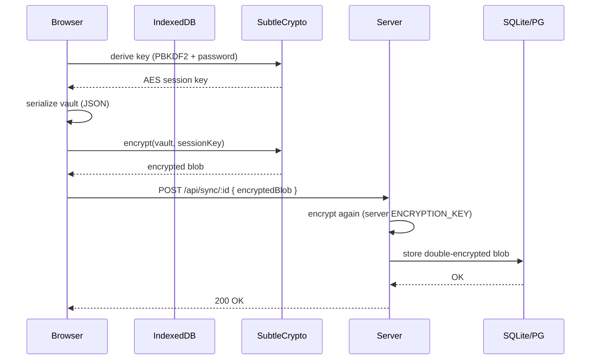
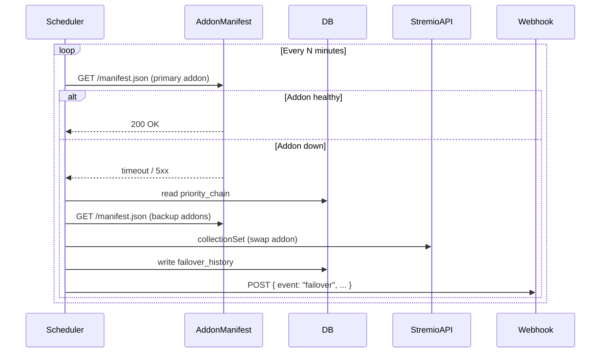
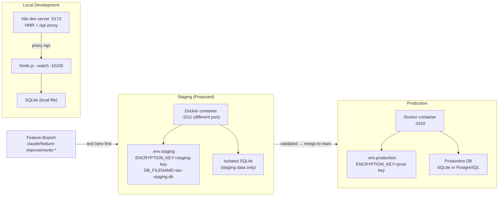

# AIOManager Architecture

## System Architecture

```mermaid
graph TB
    subgraph CLIENT["Browser (Client-Side)"]
        UI["React 18 SPA<br/>Vite · TypeScript · Tailwind"]
        STORE["Zustand Stores<br/>accountStore · addonStore<br/>syncStore · failoverStore"]
        IDB["IndexedDB<br/>(localforage)<br/>Primary local data store"]
        CRYPTO_C["SubtleCrypto API<br/>PBKDF2 + AES-256-GCM<br/>User-derived keys only"]
        WORKER["Web Worker<br/>metricsWorker.ts<br/>Off-thread analytics"]

        UI --> STORE
        STORE --> IDB
        STORE --> CRYPTO_C
        STORE --> WORKER
    end

    subgraph SERVER["AIOManager Server (Node.js 20 / Fastify 5)"]
        NGINX["Nginx Reverse Proxy<br/>Port 1610<br/>SPA routing + static files"]
        API["Fastify REST API<br/>/api/*"]
        CRYPTO_S["server/crypto.js<br/>AES-256-GCM<br/>ENCRYPTION_KEY env var"]
        AUTOPILOT["Autopilot Scheduler<br/>Cron-based health checks<br/>Failover automation"]
        PROXY["Proxy Layer<br/>stremio-proxy<br/>meta-proxy · image-proxy<br/>50-concurrent limit"]
        DB_LAYER["db.js<br/>SQLite ↔ PostgreSQL<br/>abstraction layer"]

        NGINX --> API
        API --> CRYPTO_S
        API --> AUTOPILOT
        API --> PROXY
        API --> DB_LAYER
    end

    subgraph DB["Database"]
        SQLITE["SQLite<br/>aio.db<br/>(default, single-node)"]
        PG["PostgreSQL 16<br/>(optional, HA/multi-node)"]
        DB_LAYER --> SQLITE
        DB_LAYER --> PG
    end

    subgraph EXTERNAL["External Services"]
        STREMIO["Stremio API<br/>api.strem.io<br/>Auth · Addons · Library"]
        ADDONS["Addon Manifests<br/>Various URLs<br/>Health checked by Autopilot"]
        CINEMETA["Cinemeta<br/>Metadata provider"]
        GITHUB_API["GitHub API<br/>Version / release checks"]
        WEBHOOKS["User Webhooks<br/>Failover notifications<br/>HTTP POST"]
    end

    subgraph CICD["CI/CD Pipeline"]
        GH_REPO["GitHub Repo<br/>runkpocker/AIOManagerRunk"]
        GH_ACTIONS["GitHub Actions<br/>docker-publish.yml"]
        GHCR["GHCR<br/>ghcr.io/sonicx161/aiomanager"]
        DOCKERHUB["Docker Hub<br/>sonicx161/aiomanager"]

        GH_REPO -->|"Push to main / tag v*"| GH_ACTIONS
        GH_ACTIONS -->|"Multi-platform build<br/>amd64 + arm64"| GHCR
        GH_ACTIONS --> DOCKERHUB
    end

    subgraph DEPLOY["Deployment Options"]
        DOCKER["Docker<br/>docker run -p 1610:1610"]
        COMPOSE["Docker Compose<br/>aiomanager + postgres"]
        UNRAID["Unraid<br/>Community App Template"]
        K8S["Kubernetes<br/>Stateless + shared PG<br/>Horizontal scale"]
        MANUAL["Manual Node.js<br/>npm run build && node server/index.js"]
    end

    %% Client ↔ Server
    UI -->|"REST /api/*<br/>JSON"| NGINX
    UI -->|"Direct calls<br/>(CORS via proxy in dev)"| STREMIO

    %% Server ↔ External
    PROXY -->|"Forward auth calls"| STREMIO
    AUTOPILOT -->|"Manifest health checks"| ADDONS
    AUTOPILOT -->|"Failover alerts"| WEBHOOKS
    API -->|"Metadata fetch"| CINEMETA
    API -->|"Version check"| GITHUB_API

    %% Images deployed to
    GHCR --> DOCKER
    GHCR --> COMPOSE
    GHCR --> UNRAID
    GHCR --> K8S
    MANUAL -.->|"dev only"| DOCKER
```

---

## Data Flow: Cloud Sync (Vault)

---

## Data Flow: Autopilot Failover

---

## Deployment: Staging vs Production

---

## Environment Variables Reference

| Variable | Dev Default | Staging | Production |
|---|---|---|---|
| `PORT` | 16100 | 1611 | 1610 |
| `NODE_ENV` | development | production | production |
| `DB_TYPE` | sqlite | sqlite | sqlite or postgres |
| `DB_FILENAME` | aio.db | aio-staging.db | aio.db |
| `ENCRYPTION_KEY` | (auto) | staging-specific | secret, rotated |
| `DATA_DIR` | /app/data | ./staging-data | /app/data |
| `CORS_ORIGINS` | * | * | your-domain.com |
| `LOG_LEVEL` | debug | info | warn |
| `LOG_PRETTY_PRINT` | true | true | false (JSON) |
